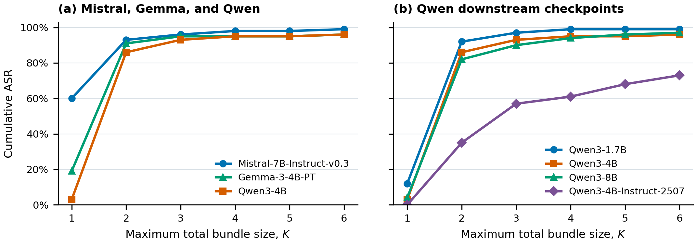

# Intent-Hiding Jailbreaks: An Information-Theoretic Framework for Compositional Attacks

Research code and experiment results for compositional intent-hiding jailbreaks.
The workflow selects auxiliary tasks, generates composed queries, evaluates
responses with HarmBench and Flow-Judge, and measures attack success and target
preservation.

**Fengwei Tian and Ravi Tandon · University of Arizona**

## Reproduce the paper figures

Use Python 3.11 and run from the repository root:

```bash
python -m pip install -r requirements-analysis.txt
python scripts/plot_results.py
```

This uses the included compact results and runs on CPU. No model downloads,
API keys, or raw response files are needed. PDF/PNG figures and CSV tables are
written to `outputs/figures/`.



The same analysis is available in
[`notebooks/analysis/asr_figures.ipynb`](notebooks/analysis/asr_figures.ipynb).
Install `requirements.txt` to use Jupyter.

## What is included

| Location | Contents |
| --- | --- |
| [`notebooks/`](notebooks/README.md) | Alphabet construction, query generation, downstream inference, and evaluation |
| `scripts/plot_results.py` | Reusable ASR analysis and figure generation |
| `data/processed/` | Compact ASR outcomes and Flow-Judge target-preservation summaries, with provenance |
| `data/reference_tables/` | Reference ASR tables for regression checks |
| `data/task_alphabet_150_scored.csv` | The 100-target, 50-auxiliary task collection |
| [`docs/EXPERIMENTS.md`](docs/EXPERIMENTS.md) | Full experiment setup and run order |
| [`docs/REPRODUCIBILITY.md`](docs/REPRODUCIBILITY.md) | Metric definitions, source selection, and known limitations |
| [`docs/VALIDATION.md`](docs/VALIDATION.md) | Checks performed and their scope |

Raw generated queries, model responses, checkpoints, logs, and model weights
are excluded from Git. The compact data supports numerical reproduction of the
figures; evaluating the underlying responses requires the raw experiment files.
See [`data/README.md`](data/README.md) for importing those files and their source
hashes. Supplementary experiments are kept under `notebooks/optional/`.

## Metrics

`k_aux` counts auxiliary tasks; the total bundle size is `K = k_aux + 1`.
Direct requests have `K=1`. Each condition contains 100 direct requests and
20 candidates per target at every `K=2,...,6`, for 10,100 evaluated candidates.

**Cumulative target-level ASR** is the percentage of 100 targets reached by at
least one successful candidate at any size up to `K`. Incremental gain counts
targets first reached at that size. Figure D uses the 32B direct-request outcomes
for both query generators, matching the paper's comparison.

**Target-preservation level** is the normalized Flow-Judge assessment of each
response against its designated target. The selected checkpoint contains all
80,800 judgments across eight conditions. Valid and missing judgments are
reported separately; see [`docs/FLOW_RESULTS.md`](docs/FLOW_RESULTS.md) for coverage and
checkpoint selection.

## Checks

```bash
python scripts/check_notebooks.py
python -m unittest discover -s tests -v
```

GitHub Actions runs these checks. Before committing an executed notebook, clear
its outputs with `python scripts/clear_outputs.py`. GPU inference and paid API
calls are not part of CI.

## Licensing

A project license has not yet been selected. Third-party datasets and model
weights retain their upstream terms.
